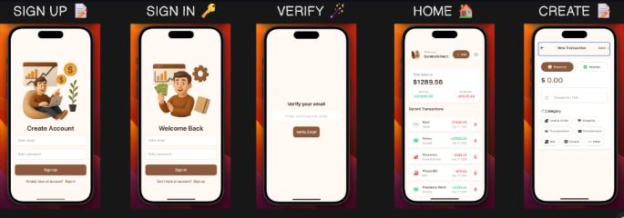
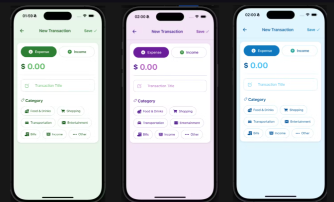

# 📱 Income & Expense Tracker App (Expo + Express + MySQL)

This project is a mobile app to track income and expenses, built with Expo (React Native) and connected to a Node.js backend with a MySQL database.

---

## 🚀 Prerequisites & Setup

Make sure you have Node.js and npm installed. Then install Expo CLI globally and clone the repository:

```bash
npm install -g expo-cli
git clone https://github.com/juniorDeveloper8/app-wallet.git
```

- Note read the readme of the backend project
- Install backend dependencies and run the server:

```bash
cd backend
npm install
# config the database
npm run dev
```
- in app execute proyect

```bash
npm install
npx expo start -c
```

- to log in to this application use gmail, this project uses clerk for security so you have to configure your .env of the project app

```bash
EXPO_PUBLIC_CLERK_PUBLISHABLE_KEY=your key the clerk
EXPO_PUBLIC_API_URL=your localhost of proyect backend http://localhost(or)yourIp/api
```
## Application model


## Topics of this application, to change the theme go to the file colors.js in the folder constans

